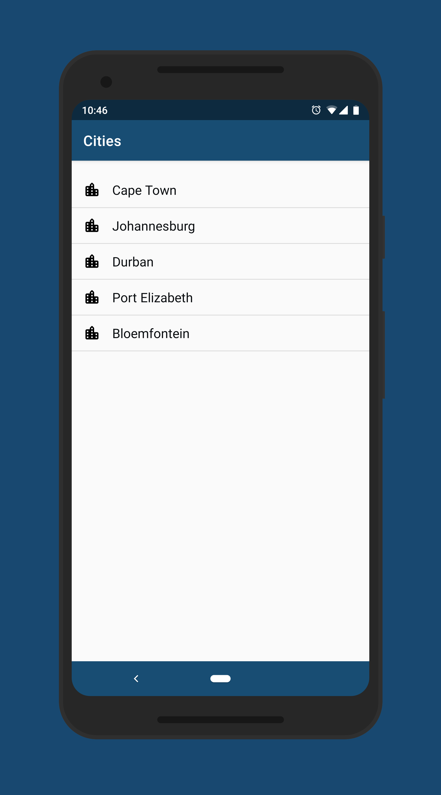
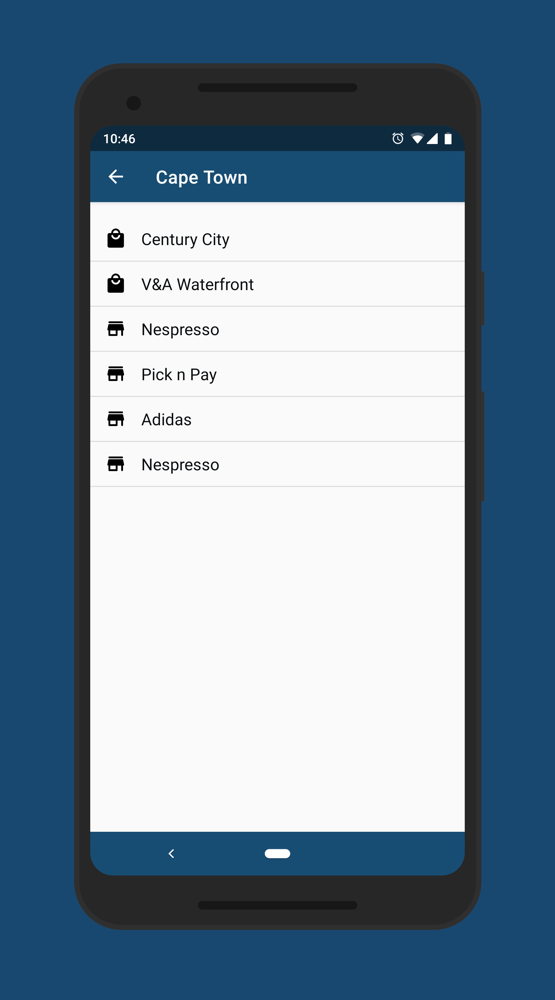
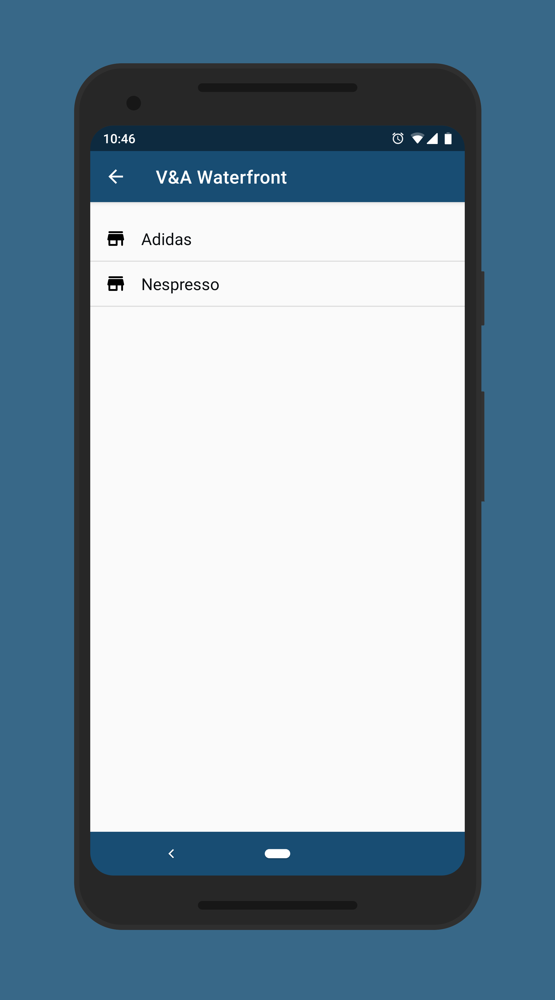

# Explorer
Submission for technical assessment

### What it does [App]
* Gives you a clear list of all cities.  
* Gives you a clear list of malls in a particular city.  
* Gives you a clear list of all shops in a particular mall.  
* Gives you a clear list of all shops in a particular city.
#### Screenshots

### What it does [SDK]
* You can request a list of cities.  
* You can request a particular city by providing the id.  
* You can request a list of malls in a particular city.  
* You can request a particular mall in a city. 
* You can request a list of shops in a particular mall.  
* You can request a particular shop in a mall. 
* You can request a list of shops in a particular city.  
* By default all queries can be handled offline.  

### Communication with sdk
* Communication with the sdk is done via the [ExplorerRepository](https://github.com/TinasheMzondiwa/Explorer/blob/master/explorer-sdk/src/main/java/com/tinashe/explorer/sdk/data/repository/ExplorerRepository.kt) class
* Get an instance of ExplorerRepository by calling 
`val repository = ExplorerSdk.getRepository(context)`  
* Responses are in RxJava's [Observable](http://reactivex.io/RxJava/javadoc/io/reactivex/Observable.html) and [Maybe](http://reactivex.io/RxJava/javadoc/io/reactivex/Maybe.html)
* Background subscriptions are handled for you, you just need to `observeOn(AndroidSchedulers.mainThread())`

### Android Studio IDE setup
Requires [Android Studio](https://developer.android.com/studio/) version 3.2 or higher.
